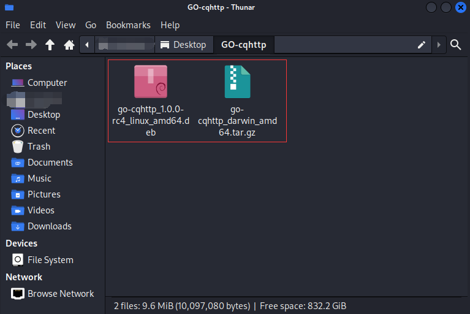
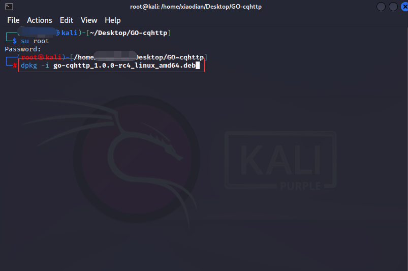
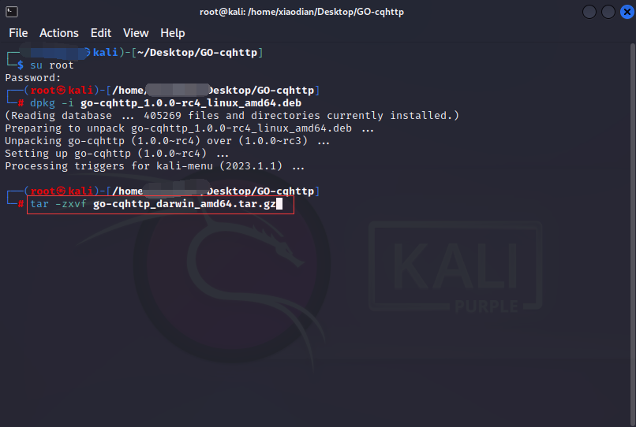
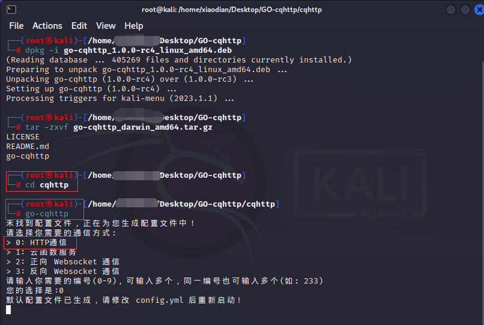
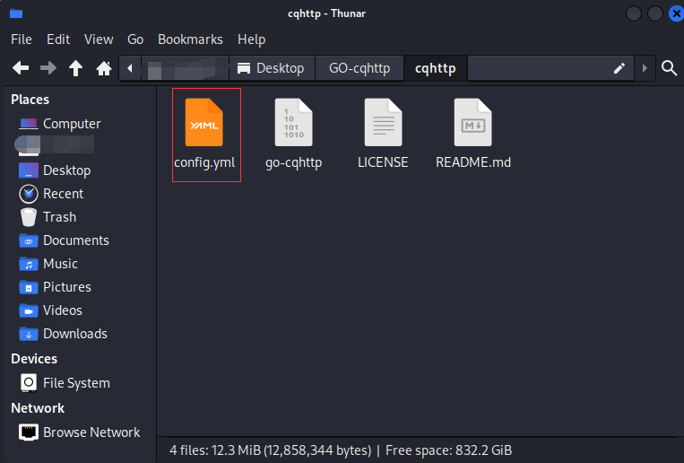

# GO-CQHTTP✨✨
### [[English]📗📗]() [[简体中文]📘📘](Chinese.md)

## Introduce
Hello, I am Ax NET<br>
Currently, I am a novice and have been exposed to this robot framework for the first time<br>
hope everyone understands and appreciates your support<br>
This robot is a QQ robot framework deployed on the Linux platform based on go cqhttp<br>
A QQ robot deployed on the Linux platform<br>
QQ robot developed based on GO-CQHTTP<br>
Currently under development<br>

## Software Architecture Description✨✨
My Linux architecture is amd64, If you have another architecture, please download the same one from the official website[[Official download address]📁📁](https://github.com/Mrs4s/go-cqhttp/releases)

## Linux Platform Deployment Tutorial
1. Deploying go cqhttp on the Linux platform requires two files, My Linux architecture is amd64, If you have a different architecture, you can download the same architecture from the official website<br>
One is the rc-4.deb installation package and one is the go cqhttp.tar.gz compressed package<br>
You can download it on the official website[[Official download address]📁📁](https://github.com/Mrs4s/go-cqhttp/releases)<br>
You can also directly download the entire project， The [[GO-CQHTTP-Document]📁](GO-CQHTTP-Document) folder contains deployment files for robot frameworks on the Windosw and Linux platforms<br>


Open the terminal in the same directory as the deployment file of the robot framework, and enter the following command in the terminal to install it

```
dpkg -i go-cqhttp_1.0.0-rc4_linux_amd64.deb
```



3. Open the terminal in the same directory as the robot framework deployment file and enter the following command in the terminal to extract the configuration file

```
tar -zxvf go-cqhttp_darwin_amd64.tar.gz
```



Open the terminal input in the directory of the configuration file you extracted: [go-cqhttp] Run the robot framework, we need to select a service. We only use HTTP services, so if you choose 0, the [config.yml] configuration file will be generated in the directory



