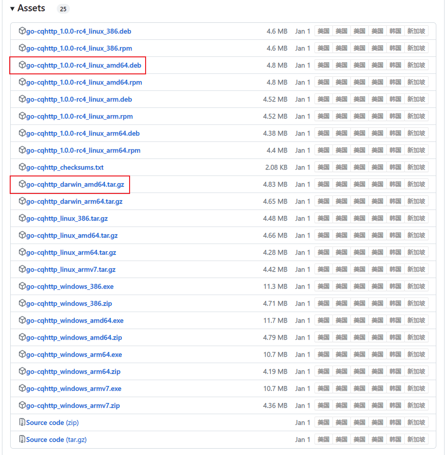
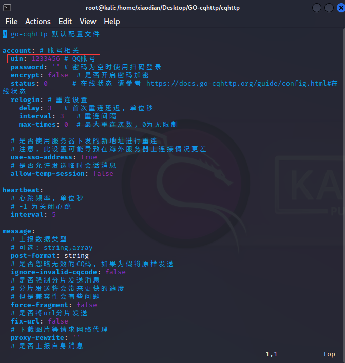
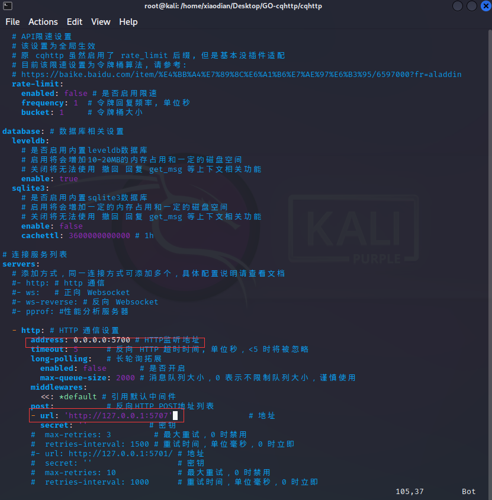
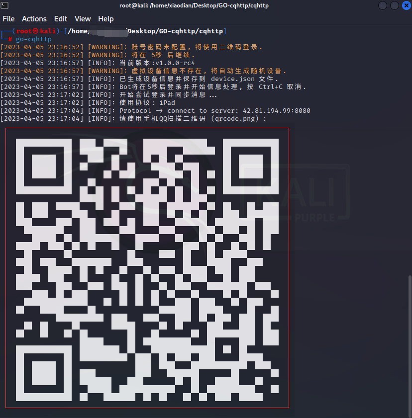
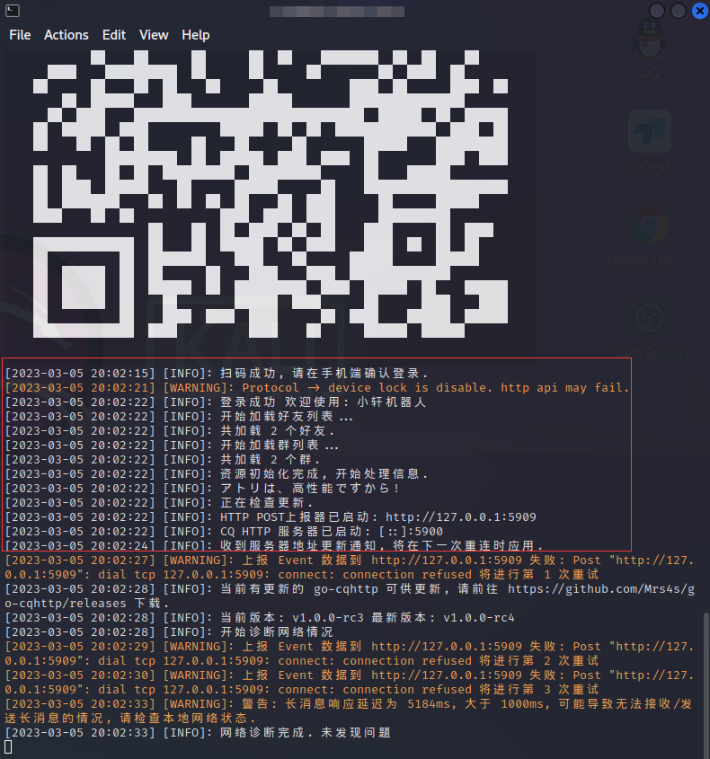
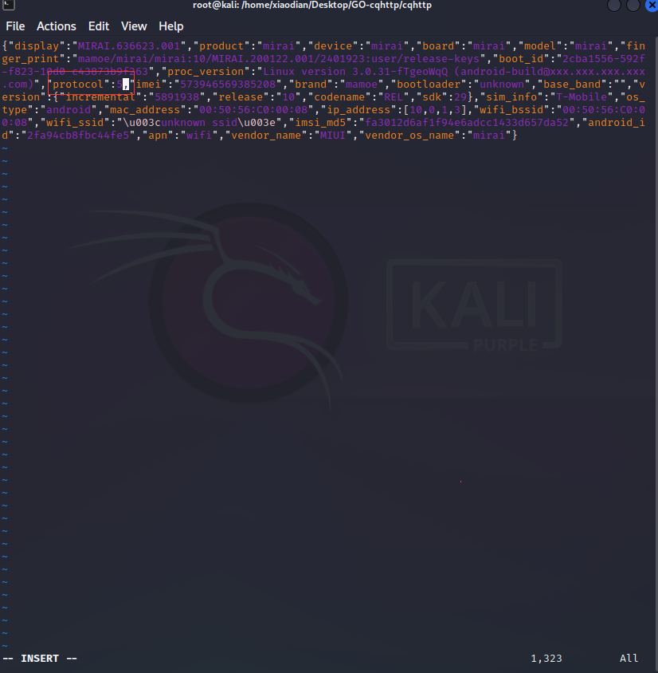

# GO-CQHTTP✨✨
### [[English]📗📗]() [[简体中文]📘📘](Chinese.md)

## Introduce
Hello, I am Ax NET<br>
Currently, I am a novice and have been exposed to this robot framework for the first time<br>
hope everyone understands and appreciates your support<br>
This robot is a QQ robot framework deployed on the Linux platform based on go cqhttp<br>
A QQ robot deployed on the Linux platform<br>
QQ robot developed based on GO-CQHTTP<br>
Currently under development<br>

## Software Architecture Description✨✨
My Linux architecture is amd64, If you have another architecture, please download the same one from the official website[[Official download address]📁📁](https://github.com/Mrs4s/go-cqhttp/releases)

## Linux Platform Deployment Tutorial✨✨
1. Deploying go cqhttp on the Linux platform requires two files, My Linux architecture is amd64, If you have a different architecture, you can download the same architecture from the official website<br>
One is the rc-4.deb installation package and one is the go cqhttp.tar.gz compressed package<br>
You can download it on the official website[[Official download address]📁📁](https://github.com/Mrs4s/go-cqhttp/releases)<br>
You can also directly download the entire project， The [[GO-CQHTTP-Document]📁](GO-CQHTTP-Document) folder contains deployment files for robot frameworks on the Windosw and Linux platforms<br>




Open the terminal in the same directory as the deployment file of the robot framework, and enter the following command in the terminal to install it

```
dpkg -i go-cqhttp_1.0.0-rc4_linux_amd64.deb
```


3. Open the terminal in the same directory as the robot framework deployment file and enter the following command in the terminal to extract the configuration file

```
tar -zxvf go-cqhttp_darwin_amd64.tar.gz
```


4. Open the terminal input in the directory of the configuration file you extracted: [go-cqhttp] Run the robot framework, we need to select a service. We only use HTTP services, so if you choose 0, the [config.yml] configuration file will be generated in the directory

```
go-cqhttp
```


5. Use vim to modify the config.yml configuration file to modify the QQ account without filling in a password. Scan QR code to log in; To modify the reverse HTTP POST address, it should be noted that the POST address matches the port of the listening address above (this is an error, the port number of the HTTP POST address cannot match the port of the previous listening address, otherwise it will prompt that the port is occupied and can be changed arbitrarily (within this range: 1025-65535), but the port number cannot be an occupied port number)

```
vim config.yml
```




6. After completing the modifications, enter the go-cqhttp command again on the terminal, start the framework, wait for a while, and scan the code to log in



7. After scanning the code, the login is successful, but before logging in, you need to scan the code on the same LAN, and your robot framework will run, and then the heartbeat mode will start normally



## Instructions for using Python files for go-cqhttp✨✨
1. According to the official [help file](https://docs.go-cqhttp.org/)Let's do it
2. Two libraries can be used, one [requests] and the other [flask]; Just use pip installation, it seems that there is no need for installation. Under Linux, it seems that all Python runtime libraries have been installed, depending on the actual situation

## Possible issues to encounter✨✨
1. There may also be an issue where you cannot log in. You may be prompted that the user's login has failed. Please try again. This may be an official issue, and the specific solution is to find the [device.json] configuration file in the go cqhttp directory
Open and modify this[protocol: 5 ]. It was originally 5 and change it to 2 to solve the problem

```
vim device.json
Before modification：protocol:5
After modification：protocol:2
```



2. Scan code login failed. Solution: It may not be in the same local area network and needs to be in the same local area network to successfully scan the code

## Final✨✨
Finally, I am Ax, a programmer who is not very good at writing code<br>
If you have any questions, please contact:[2484601608@qq.com]📧📧
